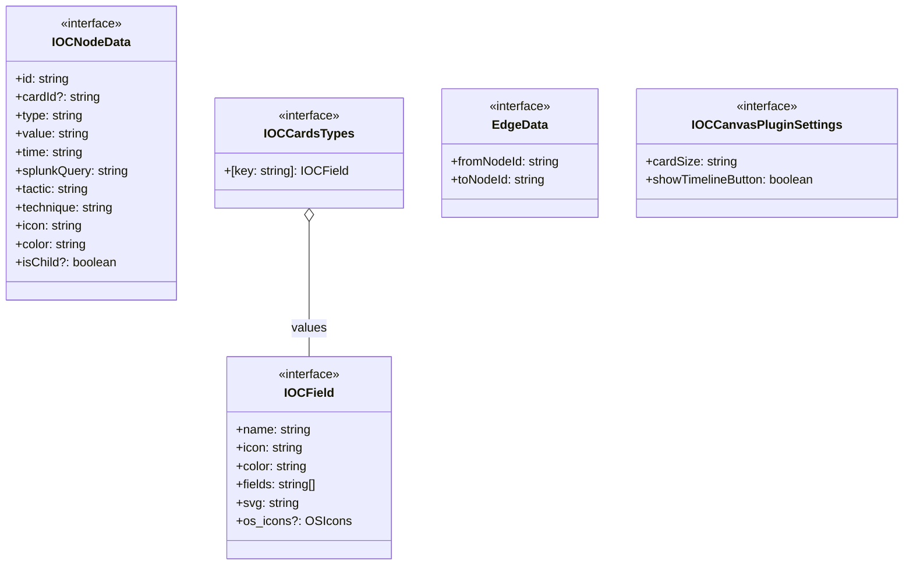
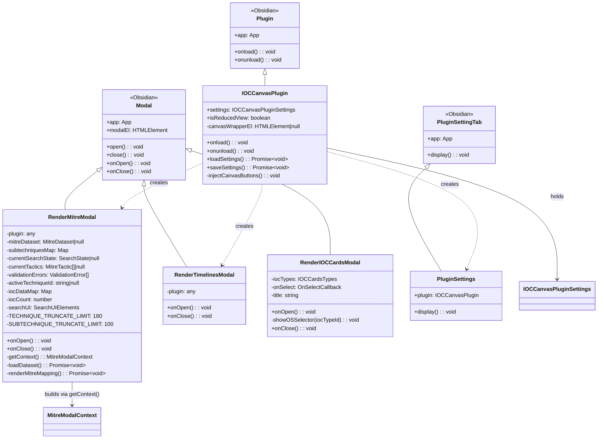
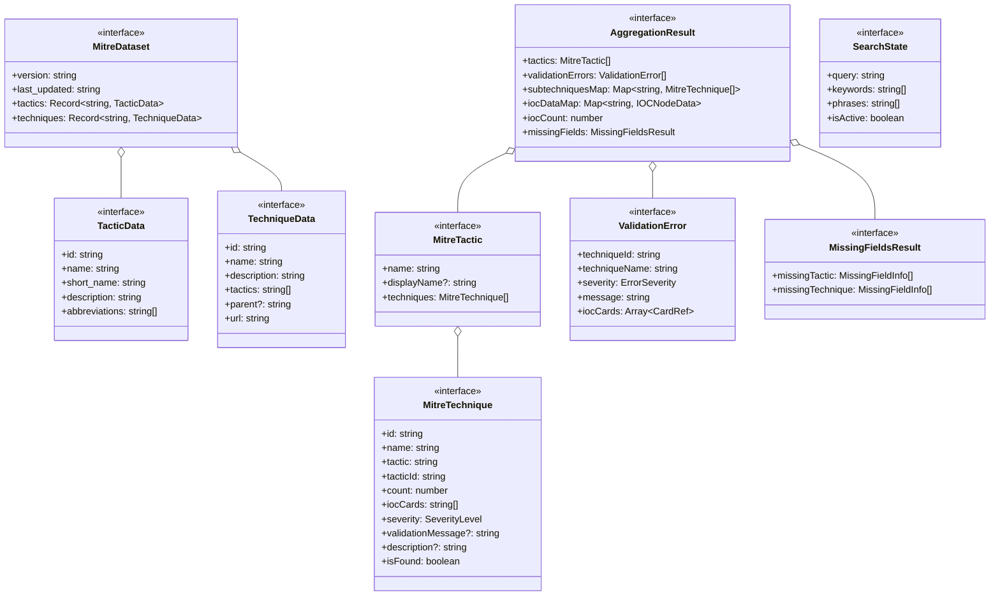
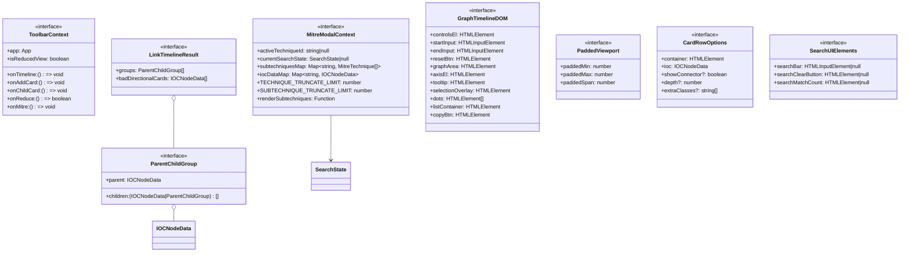
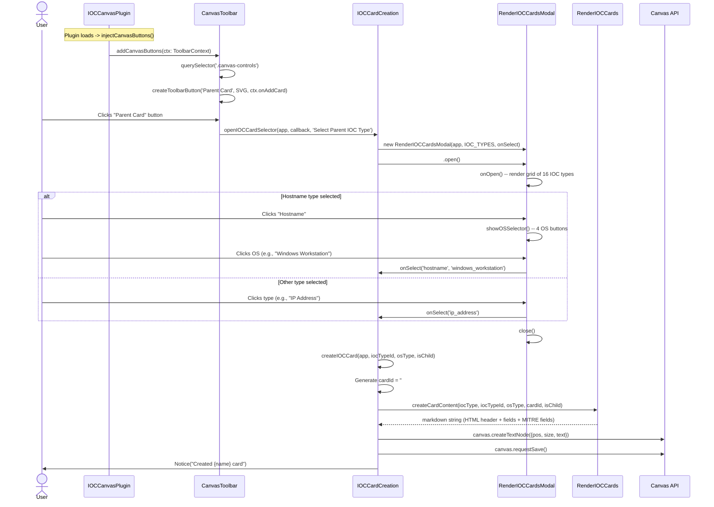
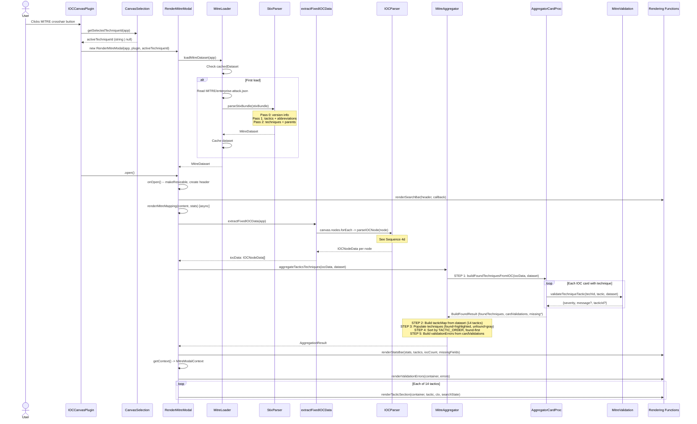
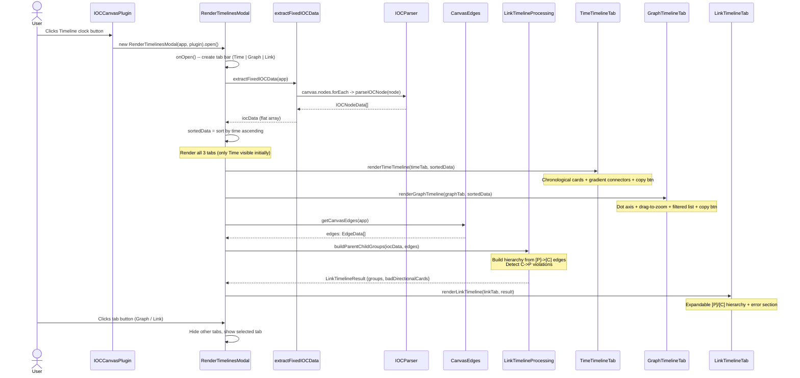
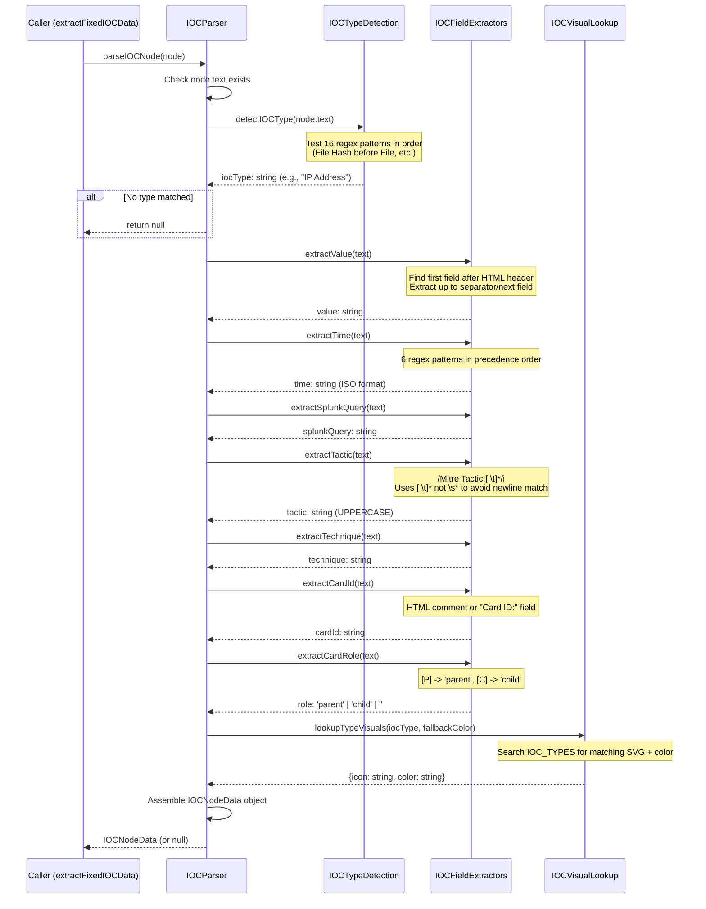

# Cyber Canvas UML Diagrams

Comprehensive UML documentation for the Cyber Canvas Obsidian plugin — a cybersecurity forensic analysis tool with IOC cards, MITRE ATT&CK integration, and timeline views. Four diagram types cover the full architecture.

---

## 1. Component Diagram (High-Level Subsystems)

```mermaid
graph TB
    subgraph Entry["Entry Point"]
        main["main.ts<br/>IOCCanvasPlugin"]
    end

    subgraph Canvas["canvas/ — UI Integration"]
        CT["CanvasToolbar"]
        CS["CanvasSelection"]
        RV["ReduceView"]
        ICC["IOCCardCreation"]
        RIC["RenderIOCCards"]
        RICM["RenderIOCCardsModal"]
        CE["CanvasEdges"]
        CCM["CanvasContextMenu"]
    end

    subgraph Parsing["parsing/ — IOC Extraction"]
        IP["IOCParser"]
        ITD["IOCTypeDetection"]
        IFE["IOCFieldExtractors"]
        IVL["IOCVisualLookup"]
    end

    subgraph Timeline["timeline/ — Temporal Views"]
        TTP["TimeTimelineProcessing"]
        TTT["TimeTimelineTab"]
        GTT["GraphTimelineTab"]
        GTH["GraphTimelineHelpers"]
        GTR["GraphTimelineRendering"]
        LTT["LinkTimelineTab"]
        LTCR["LinkTimelineCardRow"]
        LTP["LinkTimelineProcessing"]
        TCE["TimelineCopyExport"]
        RTM["RenderTimelinesModal"]
    end

    subgraph Mitre["mitre/ — ATT&CK Framework"]
        MT["MitreTypes"]
        MTU["MitreTextUtils"]
        MS["MitreSeverity"]
        MSR["MitreSearch"]
        MA["MitreAggregator"]
        MAT["MitreAggregatorTypes"]
        MACP["MitreAggregatorCardProc"]
        ME["MitreExport"]
        MR["MitreResizable"]
        ML["MitreLoader"]
        MSP["MitreStixParser"]
        MV["MitreValidation"]
        MCB["MitreCountBadge"]
        MSTR["MitreSubtechniqueRenderer"]
        MSB["MitreStatsBar"]
        MMH["MitreModalHelpers"]
        MMTR["MitreModalTacticRenderer"]
        MMV["MitreModalValidation"]
        MMS["MitreModalSearch"]
        RMM["RenderMitreModal"]
    end

    subgraph Types["types/ — Data Shapes"]
        ICT["IOCCardsTypes"]
        IND["IOCNodeData"]
    end

    subgraph Settings["settings/"]
        PS["PluginSettings"]
    end

    subgraph Shared["Shared"]
        DBG["debug.ts"]
    end

    main -->|"registers buttons"| Canvas
    main -->|"opens modals"| RTM & RMM
    main -->|"loads settings"| PS
    Canvas -->|"parses cards"| Parsing
    Canvas -->|"reads types"| Types
    Timeline -->|"parses IOC data"| Parsing
    Timeline -->|"reads edges"| CE
    Mitre -->|"parses IOC data via"| TTP
    Mitre -->|"reads types"| Types
    Parsing -->|"uses type defs"| Types

    style Entry fill:#4a90d9,color:#fff
    style Canvas fill:#5ba85b,color:#fff
    style Parsing fill:#d4a843,color:#fff
    style Timeline fill:#c76b4a,color:#fff
    style Mitre fill:#9b59b6,color:#fff
    style Types fill:#7f8c8d,color:#fff
    style Settings fill:#7f8c8d,color:#fff
    style Shared fill:#7f8c8d,color:#fff
```



---

## 2. Module Dependency Diagram

Arrows mean "imports from". Grouped by dependency layer (leaf -> entry point).

```mermaid
graph BT
    %% ===== LEAF MODULES (no internal deps) =====
    debug["debug.ts"]
    ICT["types/IOCCardsTypes"]
    IND["types/IOCNodeData"]
    ITD["parsing/IOCTypeDetection"]
    MT["mitre/MitreTypes"]
    MTU["mitre/MitreTextUtils"]
    GTH["timeline/GraphTimelineHelpers"]

    %% ===== LAYER 1 =====
    CT["canvas/CanvasToolbar"] --> debug
    RV["canvas/ReduceView"] --> debug
    CE["canvas/CanvasEdges"] --> debug
    CCM["canvas/CanvasContextMenu"] --> debug
    RIC["canvas/RenderIOCCards"] --> ICT
    RICM["canvas/RenderIOCCardsModal"] --> ICT
    IFE["parsing/IOCFieldExtractors"] --> debug
    IVL["parsing/IOCVisualLookup"] --> ICT
    MS["mitre/MitreSeverity"] --> MT
    MR["mitre/MitreResizable"] --> debug
    MSB["mitre/MitreStatsBar"] --> MT
    TCE["timeline/TimelineCopyExport"] --> IND
    LTCR["timeline/LinkTimelineCardRow"] --> IND
    GTR["timeline/GraphTimelineRendering"] --> IND
    GTR --> GTH

    %% ===== LAYER 2 =====
    MSR["mitre/MitreSearch"] --> MT
    MSR --> debug
    IP["parsing/IOCParser"] --> debug
    IP --> IND
    IP --> ITD
    IP --> IFE
    IP --> IVL

    %% ===== LAYER 2-3 (circular cluster) =====
    ML["mitre/MitreLoader"] --> debug
    ML -.->|"re-exports"| MV["mitre/MitreValidation"]
    ML --> MSP["mitre/MitreStixParser"]
    MSP -.->|"interfaces"| ML
    MV -.->|"interfaces"| ML
    MV --> debug
    MSP --> debug

    %% ===== LAYER 3 =====
    CS["canvas/CanvasSelection"] --> IP
    CS --> debug
    ICC["canvas/IOCCardCreation"] --> ICT
    ICC --> RICM
    ICC --> RIC
    ICC --> debug
    TTP["timeline/TimeTimelineProcessing"] --> IP
    TTP --> debug
    LTP["timeline/LinkTimelineProcessing"] --> IND
    LTP --> CE
    MAT["mitre/MitreAggregatorTypes"] --> IP
    MAT --> MT
    MAT --> ML
    MAT --> debug
    MMH["mitre/MitreModalHelpers"] --> MT
    MMH --> MTU
    MMH --> MSR
    MMH --> IND
    ME["mitre/MitreExport"] --> MT
    ME --> MS
    ME --> ML
    ME --> debug

    %% ===== LAYER 4 =====
    MACP["mitre/MitreAggregatorCardProc"] --> IP
    MACP --> MT
    MACP --> MS
    MACP --> ML
    MACP --> MAT
    MACP --> debug
    MCB["mitre/MitreCountBadge"] --> MT
    MCB --> MMH
    MCB --> ICT
    MCB --> debug
    GTT["timeline/GraphTimelineTab"] --> IND
    GTT --> TCE
    GTT --> GTH
    GTT --> GTR
    TTT["timeline/TimeTimelineTab"] --> IP
    TTT --> TCE
    TTT --> debug
    LTT["timeline/LinkTimelineTab"] --> LTP
    LTT --> IND
    LTT --> LTCR

    %% ===== LAYER 5 =====
    MA["mitre/MitreAggregator"] --> IP
    MA --> MT
    MA --> ML
    MA --> debug
    MA -.->|"re-exports"| MAT
    MA --> MACP
    MSTR["mitre/MitreSubtechniqueRenderer"] --> MT
    MSTR --> MTU
    MSTR --> MS
    MSTR --> MSR
    MSTR --> MMH
    MSTR --> MCB

    %% ===== LAYER 6 =====
    MMTR["mitre/MitreModalTacticRenderer"] --> MT
    MMTR --> MTU
    MMTR --> MS
    MMTR --> MSR
    MMTR --> MMH
    MMTR --> MCB
    MMTR --> debug
    MMV["mitre/MitreModalValidation"] --> MT
    MMV --> MS
    MMV --> debug

    %% ===== LAYER 7 =====
    MMS["mitre/MitreModalSearch"] --> MT
    MMS --> MSR
    MMS --> MMH
    MMS --> MMTR
    MMS --> debug
    RTM["timeline/RenderTimelinesModal"] --> TTP
    RTM --> TTT
    RTM --> GTT
    RTM --> CE
    RTM --> LTP
    RTM --> LTT
    RTM --> debug

    %% ===== LAYER 8 (top orchestrators) =====
    RMM["mitre/RenderMitreModal"] --> TTP
    RMM --> ML
    RMM --> debug
    RMM --> IND
    RMM --> MT
    RMM --> MA
    RMM --> ME
    RMM --> MR
    RMM --> MSB
    RMM --> MMH
    RMM --> MMTR
    RMM --> MSTR
    RMM --> MMV
    RMM --> MMS

    %% ===== LAYER 9 (entry point) =====
    MAIN["main.ts"] --> RTM
    MAIN --> RMM
    MAIN --> PS["settings/PluginSettings"]
    MAIN --> CT
    MAIN --> CS
    MAIN --> RV
    MAIN --> ICC
    MAIN --> CCM
    PS -.->|"type ref"| MAIN

    %% Styling
    style MAIN fill:#4a90d9,color:#fff
    style debug fill:#95a5a6,color:#fff
    style ICT fill:#7f8c8d,color:#fff
    style IND fill:#7f8c8d,color:#fff
    style MT fill:#7f8c8d,color:#fff
```



---

## 3. Class / Interface Diagram

### 3a. Core Data Types & Interfaces



### 3b. Classes (Inheritance from Obsidian)



### 3c. MITRE Data Types



### 3d. Context Interfaces & Timeline Types



### 3e. Type Aliases

```
SeverityLevel      = 'valid' | 'unknown_technique' | 'unknown_tactic' | 'mismatch' | 'not_found'
ValidationSeverity = 'valid' | 'unknown_technique' | 'unknown_tactic' | 'mismatch'
ErrorSeverity      = 'unknown_technique' | 'unknown_tactic' | 'mismatch'
```

---

## 4. Sequence Diagrams

### 4a. IOC Card Creation Flow



### 4b. MITRE Modal Flow



### 4c. Timeline Modal Flow



### 4d. IOC Parsing Flow (parseIOCNode)


