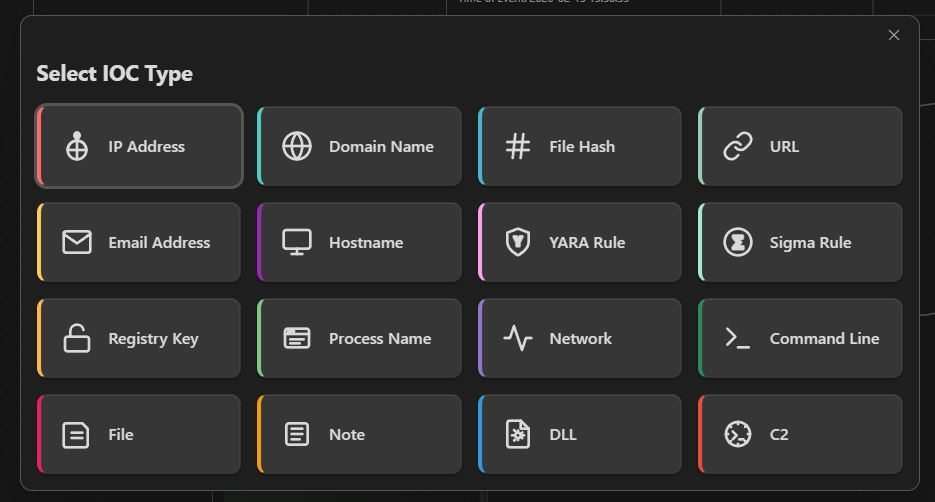
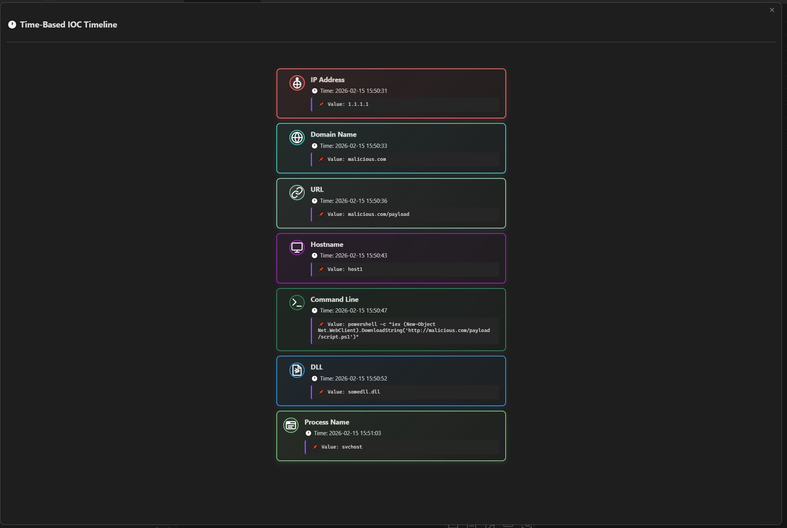
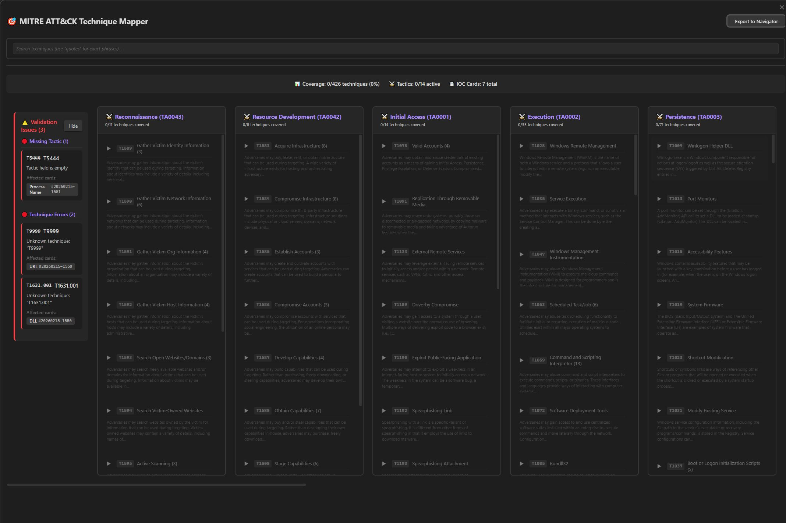

# Cyber Canvas - Obsidian Plugin for Cybersecurity Forensics

A comprehensive Obsidian plugin that transforms Canvas into a powerful cybersecurity forensic analysis workspace. Designed for security analysts, threat hunters, and incident responders who need to visualize attack chains, track Indicators of Compromise (IOCs), and map adversary techniques to the MITRE ATT&CK framework.

---

## 🎯 Features

### IOC Card System

**16 Specialized Card Types** with unique SVG icons and color coding:

- **Network:** IP Address, Domain Name, URL, Email, Hostname (with OS variants)
- **File:** File Hash, File, DLL
- **Detection:** YARA Rule, Sigma Rule
- **System:** Registry Key, Process Name, Command Line
- **Infrastructure:** Network Traffic, C2 (Command & Control)



**Automatic Metadata Fields:**

- **Time of Event:** ISO 8601 format timestamp (auto-populated with current time)
- **Splunk Query:** Pre-populated search templates for log analysis
- **MITRE ATT&CK Tactic & Technique:** For threat intelligence mapping
- **Card ID:** Timestamp-based unique identifier (#YYYYMMDD-HHMM)

**Reduce View:** Toggle compact mode to hide metadata and show only primary values (60px height)


---

### Timeline Analysis

**Time-Based Timeline:**

- Chronological sorting by "Time of Event" field
- Visual connectors with color gradients between consecutive IOCs
- Hover effects and card count indicators



**Features:**

- Automatic sorting (earliest to latest)
- Gradient connectors blend consecutive IOC colors
- Displays IOC value, time, Splunk query, and MITRE fields

---

### MITRE ATT&CK Integration

**Full Matrix Visualization:**

- Displays complete MITRE ATT&CK Enterprise matrix (14 tactics, ~800+ techniques)
- Aggregates MITRE fields from all IOC cards on canvas
- Color-coded validation with severity levels:
  - 🟢 **Green:** Valid technique-tactic pairing
  - 🟠 **Orange:** Technique exists but wrong tactic (shows correct tactics)
  - 🔴 **Red:** Unknown technique, unknown tactic, or empty tactic field
  - ⚠️ **Gray:** Valid technique but not found in IOC cards



**Interactive Features:**

- **Click techniques** to expand/collapse descriptions and subtechniques
- **Search bar** with quoted phrase support (`"spear phishing"`) or simple keywords.
- **Count badges** show how many IOC cards reference each technique
- **Validation error categories** (collapsible):
  - 🔴 **Missing Tactic:** Technique filled, tactic empty
  - 🔴 **Unknown Tactic:** Abbreviation not recognized
  - 🔴 **Technique Errors:** ID not in dataset
  - ⚠️ **Validation Mismatches:** Both valid but don't belong together

**Export to MITRE ATT&CK Navigator:**

- One-click export to JSON layer format
- Import at https://mitre-attack.github.io/attack-navigator/
- Includes:
  - Severity-based coloring (green/orange/red heatmap)
  - IOC card counts as technique scores
  - Validation messages in comments
  - Proper tactic mapping

**Supported Tactic Formats:**

- Full name: "Credential Access"
- Short name: "credential-access"
- Abbreviations: "CA", "CRED", "CRED ACCESS"

**Supported Technique Formats:**

- ID only: "T1566"
- ID with name: "T1566 - Phishing"
- Name with ID: "Phishing (T1566)"
- Subtechniques: "T1566.001 - Spearphishing Attachment"

**Dataset Management:**

- Full MITRE ATT&CK dataset in `MITRE/enterprise-attack.json` (official STIX 2.1 bundle format)
- Update dataset: Download latest from https://github.com/mitre-attack/attack-stix-data
- No preprocessing required - plugin parses STIX bundles directly

---

## 📦 Installation

### Method 1: Manual Installation (Recommended)

1. Download the latest release from GitHub Releases (or build from source)
2. Extract the ZIP file
3. Copy `main.js`, `styles.css`, and `manifest.json` to:
   ```
   <vault>/.obsidian/plugins/cyber-canvas/
   ```
4. **Download MITRE dataset (required):**
   - Visit https://github.com/mitre-attack/attack-stix-data/tree/master/enterprise-attack
   - Download `enterprise-attack.json` (50MB+)
   - Save to `<vault>/.obsidian/plugins/cyber-canvas/MITRE/`
5. Restart Obsidian
6. Enable in **Settings → Community Plugins → Cyber Canvas**

### Method 2: Coming soon, hopefully. (Using the community plugins)

---

## 🚀 Quick Start Guide

### 1. Create Your First IOC Card

1. Open a Canvas file in Obsidian
2. Click the **card icon** (📇) in the canvas toolbar
3. Select an IOC type (e.g., "IP Address")
4. For Hostname, select OS (Windows/macOS/Linux)
5. Fill in the fields:
   - Primary field (IP, domain, hash, etc.)
   - Time of Event (auto-populated with current time)
   - Splunk Query (optional)
   - MITRE Tactic (e.g., "Initial Access" or "IA")
   - MITRE Technique (e.g., "T1566 - Phishing")

### 2. Build an Attack Chain

1. Create multiple IOC cards representing attack stages
2. Connect cards with arrows (drag from edge to edge)
3. Arrange chronologically (earliest at top/left)

**Example Attack Chain:**
```
[Phishing Email] → [Malicious URL] → [File Hash] → [C2 Domain] → [Registry Key]
```

### 3. View Timeline

1. Click the **timeline icon** (🕐) in the canvas toolbar
2. Timeline shows IOCs sorted by "Time of Event"
3. Gradient connectors visually link consecutive events

### 4. Map to MITRE ATT&CK

1. Click the **crosshair icon** (🎯) in the canvas toolbar
2. Review the full MITRE matrix with your IOC cards highlighted
3. Check validation errors for incorrect tactic/technique pairings
4. Click **Export to Navigator** to create heatmap visualization

### 5. Toggle Reduce View

1. Click the **reduce icon** (⤓) in the canvas toolbar
2. Cards collapse to show only primary values (60px height)
3. Click again to restore full view

---

## 🎨 IOC Type Reference

| Type | Icon | Color | Primary Field | Use Case |
|------|------|-------|---------------|----------|
| IP Address | 🌐 | Red (#FF6B6B) | IP | Network connections, C2 servers |
| Domain Name | 🌐 | Teal (#4ECDC4) | Domain | DNS queries, malicious sites |
| File Hash | 📄 | Blue (#45B7D1) | Hash | Malware samples, file analysis |
| URL | 🔗 | Green (#96CEB4) | URL | Phishing links, exploit kits |
| Email Address | ✉️ | Yellow (#FECA57) | Email | Phishing senders, C2 comms |
| Hostname | 💻 | Purple (#9C27B0) | Hostname | Compromised systems |
| YARA Rule | 🔍 | Pink (#FF9FF3) | Rule | Malware detection |
| Sigma Rule | 📊 | Light Green (#A8E6CF) | Rule | Log analysis |
| Registry Key | 🔑 | Orange (#FFA502) | Key | Persistence mechanisms |
| Process Name | ⚙️ | Dark Blue (#2C3E50) | Process | Malicious executables |
| Network Traffic | 🌐 | Cyan (#00D2D3) | Description | Network activity |
| Command Line | ⌨️ | Gray (#95A5A6) | Command | Execution artifacts |
| File | 📁 | Brown (#A0826D) | Filename | File system artifacts |
| Note | 📝 | Light Gray (#D3D3D3) | Text | Analysis notes |
| DLL | 📚 | Indigo (#6C5CE7) | DLL Name | Library injection |
| C2 | 🎯 | Dark Red (#C0392B) | Server | Command & control |

---

## ⚙️ Configuration

**Settings → Cyber Canvas:**

- **IOC Card Size:** Default card dimensions (width × height)
- **Show Timeline Button:** Toggle timeline button visibility in toolbar

---

## 🛠️ Development

### Prerequisites

- Node.js 16+ and npm
- TypeScript 4.x
- Obsidian 1.0+ for testing

### Build from Source

```bash
# Clone repository
git clone https://github.com/yourusername/cyber-canvas.git
cd cyber-canvas

# Install dependencies
npm install

# Development mode (watch + auto-rebuild)
npm run dev

# Production build
npm run build
```

**Output:** `main.js` and `styles.css` in project root

### Project Structure

```
cyber-canvas/
├── src/                          # TypeScript source files
│   ├── main.ts                   # Plugin entry point (434 lines, 22% comments)
│   ├── IOCParser.ts              # Shared parsing logic (398 lines, 24% comments)
│   ├── RenderMitreModal.ts       # MITRE modal (1,798 lines, 19% comments)
│   ├── MitreLoader.ts            # STIX 2.1 parser (388 lines, 28% comments)
│   ├── TimeTimelineProcessing.ts # Timeline processor (79 lines, 22% comments)
│   ├── RenderTimelinesModal.ts   # Timeline UI (131 lines, 21% comments)
│   ├── RenderIOCCards.ts         # Card template generator (73 lines, 37% comments)
│   ├── RenderIOCCardsModal.ts    # IOC selector modal (138 lines, 17% comments)
│   ├── IOCCardsTypes.ts          # Type definitions (288 lines, 13% comments)
│   ├── IOCCardFactory.ts         # CRUD helpers (79 lines, 30% comments)
│   └── PluginSettings.ts         # Settings tab (69 lines, 26% comments)
├── styles.css                    # Plugin styles (859 lines)
├── MITRE/                        # MITRE ATT&CK dataset directory
│   └── enterprise-attack.json    # STIX 2.1 bundle (download separately)
├── manifest.json                 # Obsidian plugin manifest
├── package.json                  # NPM dependencies
├── tsconfig.json                 # TypeScript config
├── esbuild.config.mjs           # Build config
├── CLAUDE.md                     # Development instructions
└── README.md                     # This file
```

**Total:** 3,875 lines TypeScript (782 comment lines, 20.2% ratio)

### Architecture Overview

**Plugin Lifecycle:**
1. `main.ts` → `IOCCanvasPlugin.onload()` registers commands, ribbon icons, settings tab
2. `addCanvasButtons()` injects toolbar buttons into Obsidian's `.canvas-controls` bar on every canvas view
3. User creates IOC card → `createIOCCard()` → `RenderIOCCards.createCardContent()` generates markdown
4. User opens timeline → `RenderTimelinesModal` → `TimeTimelineProcessor.extractFixedIOCData()` → `IOCParser.parseIOCNode()` extracts data
5. User opens MITRE modal → `RenderMitreModal` → `MitreLoader.loadMitreDataset()` → `aggregateTacticsTechniques()` validates and displays

**Key Design Patterns:**
- **Shared parser:** `IOCParser.ts` handles all IOC detection and field extraction (used by timeline and MITRE modal)
- **Internal Canvas API:** Accesses `(view as any).canvas` with null checks for graceful degradation
- **STIX 2.1 native:** `MitreLoader` parses official MITRE datasets directly (no preprocessing)
- **Severity-based validation:** Uses `valid | unknown_technique | unknown_tactic | mismatch | empty_tactic` enum
- **Helper extraction:** Reusable helpers like `isCriticalSeverity()`, `getSeverityIcon()`, `applySeverityClass()`, `toggleExpansion()`

### Testing

**Manual Testing Workflow:**
1. Copy built files to test vault: `.obsidian/plugins/cyber-canvas/`
2. Reload Obsidian (Ctrl+R / Cmd+R)
3. Open canvas, create IOC cards
4. Test timeline (chronological order, gradient connectors)
5. Test MITRE modal (validation colors, expand/collapse, search, export)
6. Test reduce view toggle
7. Check browser console for errors (`console.debug()` output)

**No automated tests configured** - all testing is manual end-to-end validation

### Contributing

Contributions welcome! Please:
1. Fork the repository
2. Create a feature branch: `git checkout -b feature/your-feature`
3. Follow existing code style (JSDoc blocks, inline comments, section dividers)
4. Maintain 15-20% comment ratio for new code
5. Test thoroughly in Obsidian
6. Submit pull request with detailed description

**Code Style:**
- Use TypeScript strict mode
- Add JSDoc blocks for all public methods
- Comment complex logic inline
- Use `console.debug()` for diagnostics (not `console.log()`)
- Follow existing patterns (see `CLAUDE.md`)

---

## 📚 MITRE ATT&CK Reference

### Abbreviations Supported

| Tactic | Abbreviations |
|--------|---------------|
| Reconnaissance | RECON, RECCE, RE |
| Resource Development | RESOURCE, RES, RD |
| Initial Access | IA, INIT |
| Execution | EXEC, EXE, EX |
| Persistence | PERSIST, PERS, PS |
| Privilege Escalation | PRIV, PE, PRIVESC, PRIV ESC |
| Defense Evasion | DEFENSE, DEF, DE |
| Credential Access | CRED, CA, CRED ACCESS |
| Discovery | DISC, DIS, DI |
| Lateral Movement | LATERAL, LM, LAT MOVE |
| Collection | COLLECT, COL, CO |
| Command and Control | C2, CNC, CC |
| Exfiltration | EXFIL, EXFILTRATE, EX |
| Impact | IMP, IM |

### Validation Severity Levels

| Severity | Icon | Color | Meaning |
|----------|------|-------|---------|
| `valid` | ✅ | Green | Technique-tactic pairing is correct |
| `mismatch` | ⚠️ | Orange | Both valid but technique doesn't belong to that tactic |
| `unknown_technique` | 🔴 | Red | Technique ID not found in dataset |
| `unknown_tactic` | 🔴 | Red | Tactic name/abbreviation not recognized |
| `empty_tactic` | 🔴 | Red | Technique filled but tactic field is empty |
| `not_found` | - | Gray | Valid technique but not referenced in any IOC card |

---

## 🐛 Troubleshooting

### MITRE Modal Shows Error

**Problem:** "MITRE ATT&CK dataset could not be loaded"

**Solution:**
1. Download `enterprise-attack.json` from https://github.com/mitre-attack/attack-stix-data
2. Place in `.obsidian/plugins/cyber-canvas/MITRE/`
3. Restart Obsidian
4. Check browser console for parse errors

### IOC Cards Not Displaying in Timeline

**Problem:** Timeline shows "No IOC cards found"

**Possible causes:**
1. Cards missing "Time of Event" field → Add timestamp to cards
2. Not a text node → IOC cards must be canvas text nodes (not images/files)
3. Parser not detecting IOC type → Check that card contains IOC type name (e.g., "IP Address")

**Debug:**
1. Open browser console (Ctrl+Shift+I / Cmd+Option+I)
2. Enable `console.debug()` output
3. Check for `[IOCParser]` and `[TimeProcessor]` logs
4. Verify card text format matches expected structure

### Validation Shows Wrong Errors

**Problem:** Technique shows "Unknown" but exists in dataset

**Solution:**
1. Verify technique ID format: "T1566" or "T1566.001" (uppercase T)
2. Check tactic abbreviation against supported list (see table above)
3. Ensure no leading/trailing spaces in MITRE fields
4. Check that `enterprise-attack.json` is latest version

### Reduce View Not Working

**Problem:** Cards don't resize when clicking reduce button

**Solution:**
1. Ensure you're in a canvas view (not markdown/reading view)
2. Check that cards are text nodes (not embedded files)
3. Reload Obsidian (Ctrl+R / Cmd+R)
4. Check console for errors

---

## 📄 License

MIT License - see LICENSE file for details

---

## 🙏 Acknowledgments

- **MITRE ATT&CK®** - MITRE Corporation (https://attack.mitre.org/)
- **Obsidian** - Obsidian.md for the Canvas API
- **Contributors** - All contributors who improve this plugin

---

## 📞 Support

- **Issues:** https://github.com/yourusername/cyber-canvas/issues
- **Discussions:** https://github.com/yourusername/cyber-canvas/discussions
- **Documentation:** https://github.com/yourusername/cyber-canvas/wiki

---

## Known issues

- Mitre modal do not have mobile technique.
- Display in the tactic title the number of techniques beeing present
- Display the active techniques at the toip of the tactic
- The current active card technique and subtechnique should be highlighted in purple.